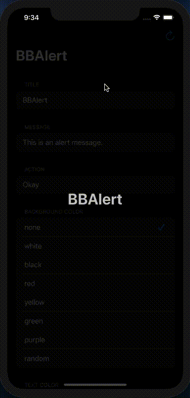
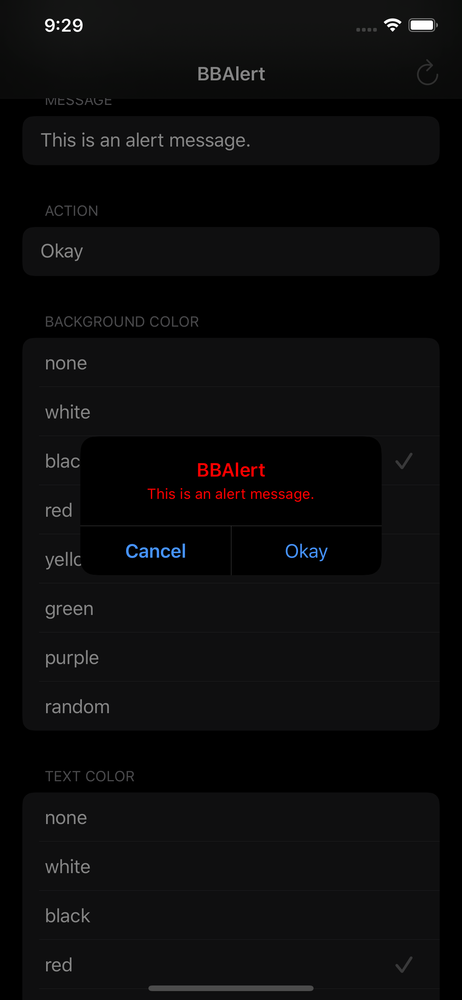
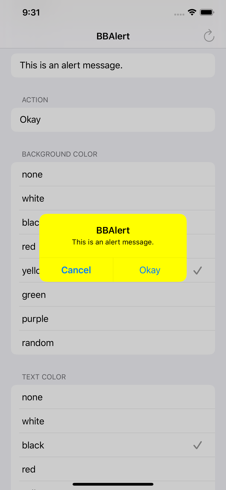

# BBAlert

Ever felt the need to customise the boring default alert provided by iOS using UIAlertController? BBAlert let's you do just that, but not at the cost of loosing functionality of UIAlertController. Since it's build as an typealias of UIAlertController it doesn't require any more of the memory. Package is compiled using Xcode 11.4.1 on MacOS 10.15.4 using Swift 5.2.2 compiler.

---

## Support

[](https://www.apple.com/in/macos/catalina/)
[](https://developer.apple.com/xcode/)
[](https://developer.apple.com/swift/)

---
## Code

```swift
import UIKit
import BBAlert

class ViewController: UIViewController {

    override func viewDidLoad() {
        super.viewDidLoad()
        
        let actions: [String: UIAlertAction.Style] = [selectedActionText: .default, "Cancel": .cancel]
        presentBBAlert(title: "Title", message: "This is a sample message", actions: actions, setup: { alert in
            alert.titleFont       = .boldSystemFont(ofSize: 20)
            alert.messageFont     = .systemFont(ofSize: 16)
            alert.backgroundColor = Color.allCases[self.selectedBackgroundColorIndex].color
            alert.textColor       = Color.allCases[self.selectedTextColorIndex].color
        }, actionHandler: { action in
            if action.title == self.selectedActionText {
                print("Selected \(self.selectedActionText)")
            }
        }) { _ in
            print("Perform stuff after completion.")
        }
    }
}
```
---
## Screenshots

<table>
  <tr>
    <td>Animation</td>
     <td>Dark mode</td>
     <td>Light mode</td>
  </tr>
  <tr>
    <td></td>
    <td></td>
    <td></td>
  </tr>
 </table>

 ---
 ## Installation

 ### Swift Package Manager

The [Swift Package Manager](https://swift.org/package-manager/) is a tool for automating the distribution of Swift code and is integrated into the `swift` compiler. It is in early development, but BBAlert does support its use on supported platforms.

Once you have your Swift package set up, adding BBAlert as a dependency is as easy as adding it to the `dependencies` value of your `Package.swift`.

```swift
dependencies: [
    .package(url: "https://github.com/bibinjacobpulickal/BBAlert.git", .upToNextMajor(from: "1.0.0"))
]
```
---
## Example
Clone or download the project. Open `.xcodeproj` file in Xcode. Change target to iOSExample and run on a device or simulator.

## License
BBAlert is released under the MIT license. [See LICENSE](https://github.com/bibinjacobpulickal/BBAlert/blob/master/LICENSE) for details.
